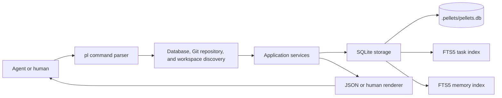

# Architecture

Pellets is a single-process Go CLI around a local SQLite database. Its optional `pl web` command is a foreground, loopback-only HTTP process over that same database. It is not a daemon or remote service, and Pellets has no external network client, plugin loader, or embedding runtime.

See [project-goals.md](project-goals.md) for the product boundary, [data-model.md](data-model.md) for schema and ordering invariants, [cli-spec.md](cli-spec.md) for the public interface, [0001-initial-architecture.md](decisions/0001-initial-architecture.md) for the initial decision, and [0002-worktree-scoped-workspaces.md](decisions/0002-worktree-scoped-workspaces.md) for its worktree supersession.

## High-level design

Each invocation follows the same shape:

1. Strictly parse global options and the subcommand, then validate all
   usage-only semantics without reading the working directory, performing
   discovery, or causing command side effects.
2. Locate the nearest `.pellets/pellets.db` by walking from the working directory toward the filesystem root, unless the command is creating a database or installing the portable agent skill.
3. Ask Git for the worktree root, worktree-specific Git directory, and shared common directory; normalize those paths relative to the database root where possible.
4. Open SQLite, configure/migrate it, and resolve the common directory to one logical project plus the worktree/Git-directory pair to its registered workspace.
5. Execute one application operation through a narrow storage interface.
6. Emit one compact, versioned JSON result to stdout, or one structured JSON error to stderr.

Commands such as `init-db` and `init` vary in discovery behavior as described in [cli-spec.md](cli-spec.md).



## Proposed Go package structure

```text
cmd/pl/                 executable entry point
internal/cli/           command definitions, flag parsing, exit mapping
internal/discovery/     database-root and Git-root discovery
internal/app/           use cases and transaction boundaries
internal/app/skill_template embedded portable pellets/SKILL.md source
internal/domain/        statuses, references, validation, typed errors
internal/storage/       storage interfaces used by app
internal/storage/sqlite explicit SQL, migrations, FTS maintenance
internal/output/        JSON v1 and human renderers
internal/webui/         loopback HTTP, templates/assets, SSE invalidation
internal/testutil/      integration database and command helpers
```

Do not create one package per command. Commands with the same domain behavior should call the same application service. Do not expose SQLite rows directly to CLI rendering.

## Dependency direction

Dependencies point inward:

```text
cmd/pl -> cli -> app -> domain
          |      |
          |      +-> storage interfaces -> storage/sqlite
          +-------------------------------> output
          +-> webui -> app/storage interfaces
cli -> discovery
storage/sqlite -> domain
```

Rules:

- `domain` imports no CLI, database, or operating-system packages beyond the Go standard library.
- `app` owns use-case sequencing and transaction requirements, not SQL syntax.
- `storage/sqlite` implements storage interfaces and owns all SQL.
- `output` consumes application result types, not database types.
- Only `cmd/pl` constructs concrete dependencies.

The storage layer is replaceable for tests, but replacement with a different production database is not a product goal.

The database-independent skill path is `cmd/pl -> cli -> app -> filesystem`, with existing Git discovery injected into the application service. It does not import or construct a storage implementation.

## Portable agent skill installer

`pl skill install` embeds one version-controlled, instruction-only `SKILL.md` template with portable `name` and `description` frontmatter. Codex and Claude receive byte-identical instructions; only their destination paths differ. No script, plugin manifest, MCP configuration, `AGENTS.md`, `CLAUDE.md`, settings file, runtime download, or prompt-framework dependency is generated.

The CLI owns the small line-oriented wizard behind injected input, output, and terminal detection. The default JSON interface never prompts. Interactive `--human` mode prompts only when stdin and stdout are terminals, shows the Git root when repository scope is available, previews exact destinations, and obtains replacement and final-write confirmation separately. Parsing and enum validation occur before working-directory or Git inspection.

The application service resolves the personal root with the platform home-directory API and the repository root with Git's existing worktree discovery. Planning is read-only: it computes the complete target matrix, checks lexical containment, walks every existing parent with `Lstat`, refuses symlink and non-regular paths, verifies usable parent permissions, reads existing regular files, and classifies them as missing, identical, or different. Dry-run stops after this plan and returns the embedded content.

Apply re-runs the full preflight before creating anything. Missing parents are created one component at a time without following symlinks. Each target is written through a same-directory temporary file and atomic rename; replacements preserve the existing file mode. For a multi-target install, original bytes and modes plus invocation-created directories form a rollback journal in memory. A later failure restores replaced files, removes files created by that invocation, and removes only now-empty directories created by that invocation. Unrelated files and existing directory modes are never changed.

Repository targets are ordinary untracked files. The installer never runs `git add`, edits `.gitignore` or the local exclude, changes the index, or commits. Personal targets are always rooted at the resolved home directory rather than a repository selected from the working directory.

## Discovery, logical projects, and workspaces

### Database discovery

For normal commands, start at the current working directory and test each ancestor for `.pellets/pellets.db`. The nearest database wins. Continue past Git boundaries so a common-parent database can serve sibling repositories.

The directory containing `.pellets` is the **database root**. A database may contain unrelated logical projects as well as several workspaces of one project.

### Git repository and workspace discovery

Use Git's own discovery semantics and `git rev-parse --show-toplevel --absolute-git-dir --git-common-dir` with absolute path formatting. The common directory identifies the logical repository. The worktree root and worktree-specific Git directory together identify the current workspace; linked worktrees therefore share one project without becoming the same workspace. Canonicalize existing prefixes, normalize separators and platform case, and store paths relative to the database root when they are beneath it, otherwise as explicit absolute paths.

All Git commands, canonicalization, existence checks, and stale-path checks finish outside SQLite write transactions. `pl init --code CODE` creates a logical project and its first workspace, attaches another linked worktree with the same code, or updates a moved workspace root only when the old registered root no longer exists. A live duplicate presenting one Git directory at a second root, an unrelated repository reusing a code, or inconsistent common/root/Git-directory identity is a typed conflict with no persistent write. Removed worktrees remain visible as stale registrations so later lifecycle recovery can name their ownership; no read command registers, moves, or removes a workspace implicitly.

### Keeping the database out of Git

The database and its WAL/SHM/journal companions must never be committed or damaged. If `init-db` or `init` places `.pellets` inside a Git work tree, it adds `.pellets/` to the repository’s local Git exclude file (`.git/info/exclude` or the worktree-equivalent path), not to the committed `.gitignore`. Initialization refuses to proceed if the database or any companion is already tracked, including an index-only or case-equivalent path on a case-insensitive filesystem. It also rejects a symlinked `.pellets` directory and any pre-existing database companion before SQLite opens a file. Failure cleanup removes only files whose identity was recorded as created by that initialization attempt.

## CLI command flow

A mutating command such as `pl start foo-12` flows as follows:

1. Parse `foo-12` into project code `foo` and number `12`.
2. Discover the database and resolve the current logical project and workspace.
3. Verify that `foo` identifies the resolved project unless an explicit `--project` override is allowed for that command.
4. Open and migrate the database.
5. Begin an immediate write transaction.
6. Load the pellet and validate the `open -> in_progress` transition against current workspace ownership.
7. Update it with the current workspace. A partial unique index rejects a second in-progress pellet in that workspace, and a composite foreign key rejects cross-project ownership.
8. Commit.
9. Render the result as JSON v1.

Expected domain conflicts—missing pellet, wrong status, `workspace_already_in_progress`, or `pellet_in_progress_elsewhere`—are typed errors. They are not detected by parsing SQLite error strings in the CLI layer.

## SQLite storage boundary

Use `database/sql` with a pinned CGo-free SQLite driver, initially `modernc.org/sqlite`. This keeps macOS/Windows cross-compilation simple and provides SQLite and FTS5 in-process. Pin the driver and its required companion versions exactly; upgrades require migration and cross-platform test runs.

Each short-lived CLI process uses one open SQLite connection. Set both maximum open and idle connections to one; this avoids connection-local PRAGMAs silently differing inside a process and is sufficient because a command executes one use case at a time.

At open time, configure and verify:

```sql
PRAGMA foreign_keys = ON;
PRAGMA trusted_schema = OFF;
PRAGMA journal_mode = WAL;
PRAGMA synchronous = FULL;
PRAGMA busy_timeout = 5000;
```

Also verify that FTS5 is available by executing a small capability check. Failure is fatal because keyword search and memory are first-release features.

Keep SQL as embedded `.sql` files or focused Go constants. Do not introduce an ORM or a general query builder.

## Foreground web inspector

`pl web [--port PORT] [--no-open]` uses the same upward nearest-database discovery as ordinary commands. It listens with `tcp4` on exactly `127.0.0.1`; port zero asks the OS for an available port. The URL is printed only after `net.Listen` succeeds and the HTTP server has been scheduled. Unless `--no-open` is supplied, the platform launcher opens that URL after readiness. Launcher failure is a warning and does not stop the server. Interrupt cancellation performs bounded HTTP shutdown and closes every SQLite handle. There is no daemonization, background service, configuration file, or remotely selectable bind address.

The web process owns three deliberately separate database paths:

1. A read pool opens the file with URI `mode=ro` and connection-local `query_only=ON`, `trusted_schema=OFF`, and the normal bounded busy timeout. Every GET, initial page, HTMX fragment, and recovery poll uses this pool. Query rows are always scanned into Go values and closed before template or network output begins.
2. One writer pool has one connection and uses the existing immediate-transaction queue and memory helpers. Form parsing and usage validation finish before a writer transaction starts. The writer commits or rolls back before any template, SSE, browser, or network work.
3. Exactly one monitor pool has one connection and one pinned `*sql.Conn`. It also uses `mode=ro` and `query_only=ON`. Only while SSE clients exist, the monitor issues one immediate `PRAGMA data_version` query at a bounded interval. It never begins an explicit transaction and holds no rows between checks.

SQLite documents that [`PRAGMA data_version`](https://sqlite.org/pragma.html#pragma_data_version) values are meaningful only when two values come from the same connection. A change means that some other connection committed; it does not identify a table, row, order, or number of commits. The web writer is intentionally a different connection, so both its commits and commits from CLI processes change the pinned monitor's observation. Rollbacks and reads do not. The monitor therefore treats a changed value only as an invalidation signal, coalesces bursts, and broadcasts a bounded `pellets-invalidate` SSE message containing no row data, database path, or capability. Each visible HTMX fragment then performs its normal authoritative GET. Native `EventSource` reconnect plus slower HTMX polling and initial loads repair missed messages.

Do not replace this design with SQLite update, pre-update, WAL, commit, or filesystem hooks. SQLite's [`sqlite3_update_hook`](https://sqlite.org/c3ref/update_hook.html) is connection-local, omits several write classes, and cannot observe other processes as the source of truth. Pellets adds no change-log table, notification trigger, watcher, or notification-only write.

SSE clients own only bounded in-memory channels. They never own a database handle or transaction, and a full client queue is skipped so a slow browser cannot block the monitor or other clients. Keepalives are comments with no database data. Response writes have bounded deadlines and shutdown cancels every client handler.

All editable rows carry an opaque SHA-256 version token derived from JSON encoding of the complete authoritative Go row, including identity, nullable values, lifecycle/order/ownership, provenance/approval, and timestamps. The storage method reloads the row and validates the submitted token only after `BEGIN IMMEDIATE`. Mismatch returns the current materialized row, rolls back without a write, and becomes HTTP 409 beside the preserved submitted draft. Creation has no pre-existing row token. Memory text replacement deletes the old external-content FTS row, changes authoritative text, and inserts the new FTS row in that same short transaction.

The HTTP mutation surface requires the exact listener `Host`, exact same-loopback `Origin`, a per-process cryptographically random CSRF capability in both a `SameSite=Strict`/`HttpOnly` cookie and form, POST, and `application/x-www-form-urlencoded`. Responses set a restrictive CSP permitting only repository-owned same-origin scripts/styles/connects, disable framing and MIME sniffing, and use `html/template` escaping. Assets are embedded: pinned HTMX 2.0.4 plus its Zero-Clause BSD license, repository JavaScript for native EventSource/theme/focus enhancements, and hand-authored CSS. Runtime CDN, font, icon, Node/npm, WebSocket, HTMX SSE extension, and framework dependencies are absent.

## Transaction strategy

SQLite permits multiple readers and one writer. Short atomic writes are sufficient for independent worktree workers and several projects in one database.

- Read-only commands use a read transaction only when they need a consistent multi-query snapshot.
- Every mutation uses a transaction.
- ID allocation, `start`, `start-next`, lifecycle recovery, `move`, priority rebalancing, and `purge` use a dedicated-connection write helper that executes `BEGIN IMMEDIATE`, `COMMIT`, and rollback semantics explicitly, so contention is discovered before partial work begins.
- The application retries `SQLITE_BUSY` only for a small bounded interval covered by the busy timeout. It never waits indefinitely.
- A move and any required rebalance commit atomically.
- One in-progress pellet per workspace, same-project ownership, status/ownership consistency, and uniqueness of non-null project priority are database constraints, so correctness does not depend only on application checks.

Priority rebalancing is infrequent, project-scoped, and limited to `open` and `in_progress` rows. Closed and deferred rows have `NULL` priority, are absent from the partial priority index, and are never reprocessed by a rebalance. A rebalance may briefly hold the database’s single writer lock across projects, so the transaction must contain no filesystem work, Git calls, rendering, or user prompts. See [data-model.md](data-model.md#moving-and-rebalancing).

## Migration strategy

Migrations are ordered forward SQL files embedded with `go:embed`. SQLite's application-owned [`PRAGMA user_version`](https://sqlite.org/pragma.html#pragma_user_version) is the sole authoritative on-disk schema version; there is no migration metadata table. Version 0 means an empty or uninitialized database, and a new database reaches the executable's latest version through the same runner as every upgrade. Migration names exist only for executable diagnostics.

The embedded sequence must begin at version 1 and have no duplicate, missing, or out-of-order version. The executable validates that contract before opening a connection that could write. Every migration file becomes immutable when released. Because `user_version` does not retain names or checksums, compatibility tests keep a frozen real-database fixture for every released schema version and exercise forward migration from those fixtures. Framework tests inject a two-step test sequence; production does not gain a no-op migration solely to test the runner.

On database open:

1. Read `PRAGMA user_version` before any persistent write. Reject a negative version as invalid, a version-0 database with persistent schema as unsupported, and a version newer than the executable understands, all with stable typed errors and without changing the database.
2. Run the read-only `PRAGMA integrity_check` and the declared read-only schema preflight for that supported version before changing journal mode or beginning a migration. A malformed SQLite image is `database_corrupt`; a non-SQLite or unsupported file format is `database_incompatible`; a valid SQLite file whose declared supported version does not match its required schema is `schema_version_unsupported`. These failures are write-free and expose no raw SQLite diagnostics.
3. If the version is already current, perform no migration transaction and no schema-version write.
4. If the version is older, use the same connection to acquire SQLite's writer lock with [`BEGIN IMMEDIATE`](https://sqlite.org/lang_transaction.html#deferred_immediate_and_exclusive_transactions), then re-read and revalidate `user_version`. This re-read prevents a second process that waited for the lock from applying migrations already committed by the first.
5. Apply every missing migration in strict consecutive order in that transaction. Run each migration's assertions after its SQL succeeds, then set `PRAGMA user_version` to that migration's version before continuing.
6. Run `PRAGMA foreign_key_check`, verify every declared external-content FTS index against its authoritative content with FTS5 `integrity-check` rank 1, and rerun `PRAGMA integrity_check` after all pending migrations and before `COMMIT`.

Any SQL, migration assertion, `user_version`, foreign-key, FTS, database-integrity, or commit failure causes an explicit rollback. Schema changes and every `user_version` advance therefore commit together or the database retains its preceding schema and version. A migration writer-lock timeout uses the same bounded five-second policy and stable `database_busy` response as ordinary mutations.

Migrations are forward-only and are applied exactly once according to the locked `user_version`; they need not be independently idempotent. Destructive table rewrites should use SQLite’s create-copy-validate-swap pattern. FTS indexes are derived and may be dropped and rebuilt from authoritative tables during migration.

The first release does not promise downgrade compatibility. A future migration that destroys information must first add a database backup/export mechanism.

## Memory subsystem

Memory is a small application service over an authoritative `memories` table and a derived FTS5 index. It has no vector extension or embedding provider.

The memory service supports create, list, show, search, approve, edit through the web application boundary, and remove through the confirmed CLI boundary. It records whether a memory was created by an agent or a human and whether a human has approved it. Memory belongs to a project but has no foreign key to a pellet and no structured group; references such as `foo-123` or group names are ordinary searchable text.

The task service does not automatically create memories. See [memory.md](memory.md).

## Error handling

Use typed errors with stable machine codes, for example:

- `database_not_found`
- `project_not_registered`
- `workspace_not_registered`
- `project_repository_already_registered`
- `project_code_already_registered`
- `invalid_reference`
- `pellet_not_found`
- `invalid_status_transition`
- `workspace_already_in_progress`
- `pellet_in_progress_elsewhere`
- `workspace_identity_conflict`
- `active_pellet_outside_filter`
- `priority_conflict`
- `fts_unavailable`
- `database_busy`
- `database_corrupt`
- `database_incompatible`
- `database_migration_failed`
- `schema_version_invalid`
- `schema_version_unsupported`
- `schema_too_new`
- `confirmation_required`

Wrap internal causes for diagnostics, but never expose stack traces or raw SQL in default JSON. Human output may include a concise recovery hint. Exit-code mapping is specified in [cli-spec.md](cli-spec.md#exit-codes).

## Cross-platform distribution

Build one executable per supported target with `CGO_ENABLED=0`. The first-release support matrix is:

| Target | Status | Required validation |
|---|---|---|
| macOS AMD64 | Supported | CGo-free cross-build plus the current native macOS CI suite |
| macOS ARM64 | Supported | CGo-free cross-build plus the current native macOS CI suite |
| Windows AMD64 | Supported | CGo-free cross-build plus the native Windows PowerShell CI suite |
| Windows ARM64 | Excluded | Requires native ARM64 CI and hardware/VM validation before support or release |

A successful Windows ARM64 cross-build alone does not establish support, so the first release does not build, test, or release that target.

Release archives contain only `pl` (or `pl.exe`) plus license information and checksums. No SQLite DLL, model, configuration file, or installer is required.

macOS is the only platform available for hands-on testing. Windows behavior must therefore be covered by CI integration tests, including path separators, file locking, WAL cleanup, Unicode paths, local Git excludes, and executable exit codes. Code signing is an open release question.

### Same-repository Homebrew tap

The application repository is also the project-owned Homebrew tap. Its
top-level `Formula/pl.rb` is macOS-only and selects the immutable versioned
GitHub Release archive and SHA-256 for the native AMD64 or ARM64 architecture.
The formula installs only `pl`; its test runs `pl --version`, and neither the
install method nor the test performs network activity. The nonstandard tap
repository name requires the explicit URL form documented in `README.md`.

Before a stable `vX.Y.Z` tag, the repository-owned formula updater renders the
formula from the release builder's checksum manifest. The tag build uses the
pinned release Go toolchain, checks that the committed formula has exactly the
tag version, both fixed macOS asset names and their actual hashes, and performs
a native cached-archive Homebrew install/test with formula network access
denied. GitHub Release publication depends on that check and the complete
macOS/Windows platform gate, so stale formula metadata cannot be published.
The project creates no separate tap repository, bottles, or `homebrew/core`
submission.

### Same-repository Scoop bucket

The application repository is also the project-owned Scoop bucket. Its
top-level `bucket/pl.json` contains only Scoop's required version, homepage,
license, Windows AMD64 GitHub Release URL and SHA-256, and the `pl.exe` binary
declaration. Scoop therefore installs the release archive per user, creates the
`pl` shim on PATH, and needs no installer, elevation, or separate bucket
repository.

Before a stable `vX.Y.Z` tag, the repository-owned manifest updater renders
the manifest from the release builder's checksum file after independently
hashing the Windows archive. macOS CI checks the committed JSON structure and
the tag build requires the committed version, fixed asset name, and hash to
match those verified inputs. Windows CI adds the checked-out application
repository as a bucket, installs from the verified cached archive, runs
`pl --version`, exercises the normal update path, and uninstalls it. GitHub
Release publication remains behind that platform gate, so stale Scoop metadata
cannot be published. The project creates no separate bucket, external bucket
submission, installer, or package-management framework.

## Explicitly absent components

There is no package or boundary for:

- dependencies or graphs;
- tags or task notes;
- a group entity, hierarchy, or many-to-many label system;
- task events/history;
- vector search or embeddings;
- agent accounts, PID/session ownership, leases, heartbeats, expiry, or assignment history (the workspace foreign key is only worktree-scoped coordination);
- synchronization;
- plugins;
- generated agent configuration beyond the portable Pellets skill;
- a daemon, remote bind address, or remote network transport.

Adding any of these requires a new decision record rather than an opportunistic schema change.
