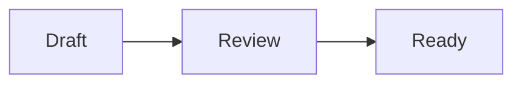

# Workbench browser interface

The production browser uses the Workbench v2 presentation in
`internal/webui/templates/` and embedded offline assets. The authoritative design
reference was `pellets-exp/iterations/workbench-v2`; production does not import or
write prototype state. Palette tokens and the presentation-only dropdown component
are adapted from that reference. Go, SQLite, and Datastar remain the application
boundaries. JavaScript holds presentation state, never ownership or execution
selection.

## Navigation and presentation

The first breadcrumb selects the project. The second selects the shared Queue,
Memories, Groups, or a registered workspace. Workspace links appear in the left sidebar.
A workspace queue uses `/projects/CODE/tasks?workspace=ID`; existing
`/projects/CODE/workspaces/ID` links still open that workspace queue. The execution
sidebar always has an explicit project-local workspace, including while browsing
Memories or the shared Queue. The existing shared Queue entry point is retained;
workspace URLs preserve a selected workspace. Browsing status, group, external ID, search, and sort
remain independent from scheduler selection.

Queue rows are 37 pixels high with reference, lifecycle status, title, group, and
owner. Narrow layouts prioritize reference, status, and title; full metadata stays
in the dialog. Pellet dialogs open with a formatted Markdown description; title and metadata
remain editable. Memory dialogs open directly in edit mode. Both close on a backdrop
click or Escape. Unsaved edits retain the discard guard. A fixed dialog footer places Cancel and
the primary save action on the right. More actions on the left contains lifecycle
operations and memory approval; queue and scope controls stay beside their fields. They support optimistic conflicts,
lifecycle operations, recovery, provenance, and explicit human memory approval.
An owned pellet and a running process remain distinct.

The Filters control shows the selected status and opens a panel for queue filters
and sorting. It stays anchored beside search without moving the toolbar. The panel
fits the viewport above the scrolling panes and dismisses on Escape, outside
click, or keyboard focus leaving it. A nested selector consumes the first Escape.
Changes apply immediately; Clear filters preserves the browsing workspace,
execution sidebar selection, and sort order.

Both sidebars collapse independently using the bottom corner buttons. The theme
selector immediately precedes the execution toggle and offers Gruvbox Light,
Gruvbox Dark, Light, Dark, and Icy. Theme, panel visibility, and the Plan/Execution tab are database-wide SQLite settings, initialized from existing browser preferences only when unset. Saved database values take precedence on reload. Changes apply immediately without rebuilding dialogs or execution; failed saves offer Retry. Browser localStorage values are fallback
presentation values applied before first paint. Theme updates do not navigate,
rebuild execution, or discard input. Minor changes darken secondary light-theme
text from the prototype to retain readable contrast.

At phone widths, navigation becomes compact horizontal rows and the shared right
panel opens over the available content area. Both stay independently collapsible. The status bar remains
pinned, and the breadcrumb continues to navigate when the left sidebar is hidden.

### Group details and shared context

**Groups** in the project navigation and view switcher opens the project group
catalog, including groups without member pellets. **Create group** adds an empty
group using the shared group operation; duplicate exact names are rejected.
Queue group names and **Open group details** in pellet dialogs open the same
stable `/projects/CODE/groups/ID` route. Member links open pellet details; **Filter
queue by this group** explicitly applies the group's current exact name. Group
navigation retains the execution workspace. The Receives assignment chips and
**Edit assignments** continue to open routing controls and never open details.

Group details show the current raw Markdown context and all member pellets,
including closed and deferred members. The context and identity survive the last
member leaving. **Edit**, **View / Preview**, **Contents**, Mermaid and the diagram
zoom/pan viewer reuse the description components below, with accessible **Shared
context** labels. The source limit is 1 MiB of UTF-8; form transport accommodates
URL-encoding expansion. Empty source is valid: delete it and **Save context** to
clear it. Context is shared with every member pellet. Edits affect future runs;
active and resumed runs retain their captured context version.

**Rename group** is a separate guarded editor. It preserves group identity,
context, membership and routing assignments. Both name and context mutations
submit the stable group ID and exact positive `revision` through the shared group
operations. Responses expose `data-group-id` and `data-group-revision`; the form
retains its revision while dirty. A stale save does no write, keeps the editable
draft and its selected mode, shows current saved fields, and requires an explicit
reviewed retry. Navigation and Cancel use the existing dirty-discard guard.
Live patches preserve drafts, focus, source selection, rendered scroll, and the
Plan/Execution view; themes never save or replace source. Presentation receipts
use project/group identity, so renaming does not reset reading state.

`POST /projects/CODE/groups` accepts `_csrf,name`;
`POST /projects/CODE/groups/ID/context` accepts `_csrf,revision,context`;
`POST /projects/CODE/groups/ID/rename` accepts `_csrf,revision,name`.
The normal local-origin, CSRF, field validation and Datastar revision contracts
apply. Stored context is raw Markdown; local rendering uses the same safe offline
renderer and diagram limits as pellet descriptions.

Run `node scripts/test-web-groups-browser.cjs` and repeat with
`PLAYWRIGHT_BROWSER=webkit`. Disposable fixtures cover creation, empty groups,
members and last-member changes, raw context saving/clearing, 1 MiB documents,
renaming, stale drafts, offline Markdown/Mermaid, contents, zoom, keyboard guards,
live refresh, five themes, widths from 390 to 1280px, and distinct routing controls.

### Description reading and editing

Existing pellet descriptions open in **View / Preview**. Choose **Edit** to work
on the original Markdown source, then **View / Preview** to inspect unsaved
changes. New-pellet forms and proposed-pellet dialogs start in **Edit** and offer
**Preview**. Switching modes never saves or changes source. Use **Save changes**
for a pellet, **Create pellet** for a new record, or the proposal editor’s existing
autosave and explicit Create action. Cancel and navigation retain the dirty-discard
guard; accepting discard removes the draft.

Headings, paragraphs, emphasis, links, nested lists, task lists, blockquotes,
inline/fenced code, tables, and horizontal rules render locally in every theme.
Code and wide tables scroll within the description. Supported code languages
reuse the activity highlighter; unknown languages stay as readable code.
Fences labeled `mermaid` render local diagrams (see below). Raw HTML displays as
text. Unsafe link schemes are disabled,
images display their alternative text without fetching resources, and links open
separately so they do not navigate away from unsaved edits.

The selected mode, source selection, focus, and scroll positions survive live
updates and reopening a record in the same browser tab. Native source fields and
optimistic versions still own submission. If a pellet edit conflicts, its unsaved
fields remain editable and the dialog shows both submitted and current saved
fields for comparison. Review them before saving again; nothing is retried
automatically. CLI output, JSON, search and agent context continue to use the
original Markdown, with no stored HTML or migration.

Pellet dialogs provide a document-local **Contents** toggle in rendered mode
whenever at least one Markdown heading exists. At viewport widths of **960px or
wider**, contents opens automatically exactly when there are **two or more
headings** and the rendered description's `scrollHeight` exceeds its
`clientHeight` by **more than 1px**. The 208px rail and 16px gap widen the dialog
by 224px, retaining the document's reading width. The rail and document scroll
independently. Short, single-section, and headingless descriptions have no
automatic rail; headingless descriptions also have no toggle. A user's explicit
wide-screen toggle overrides the automatic rule for that record in the current
browser tab. Below 960px, Contents starts collapsed and opens a bounded list
above the document. Choosing a section collapses that list. It never overlays
the text. The compact and wide-screen choices are independent.

The outline follows rendered heading nodes in document order, nested beneath
the nearest preceding lower-level heading; skipped levels do not create empty
entries. Fenced code, Mermaid source/SVG and literal HTML contribute no headings.
Labels use rendered text, including inline formatting and decoded entities.
Anchors combine the document key with a Unicode-preserving, NFKC-normalized,
lowercase heading slug. Punctuation becomes separators, empty slugs use
`section`, and numerical suffixes resolve all collisions, including names that
already end in a number. The same document source produces the same IDs; source
and database records are never rewritten.

Contents is a labeled navigation landmark with nested lists and native links.
Click or Enter focuses the destination heading and scrolls only the description
viewport, leaving a 12px inset below its edge. The dialog chrome is outside this
viewport. Navigation preserves the workbench URL, selected pellet and surrounding
scroll positions. The current entry has `aria-current="location"`, a visible
marker and emphasis; manual scrolling and asynchronous diagram resizing update
it. Focus is visible and reduced-motion preferences disable smooth scrolling.
Saved/live edits and unsaved previews rebuild the outline, retaining the current
heading and its offset where its anchor survives. Source caret and drafts retain
the existing mode-switching behavior. The feature-owned `pl-description-reader`
disconnects its listeners and resize observer when removed and observes content
blocks as well as the reading viewport, so delayed diagram layout is tracked.

`assets/markdown.js` exports `renderMarkdown(source)`, returning a DOM fragment
from a pinned, locally bundled Marked lexer. Only explicit element/attribute
choices become DOM; raw parser HTML is never inserted. Headings expose
`data-markdown-heading` for document outlines, and fences expose `data-language`.
The license and
package integrity are in `MARKED-LICENSE.txt` and `MARKED-NOTICE.txt`.
`description.js` adds presentation around native fields and keeps bounded
presentation receipts without storing a second copy of the source. Optional
`data-description-label` and `data-description-empty` customize the shared toolbar,
preview/contents accessible labels, and empty-state copy for group context.
The default remains Description; the native labeled textarea owns the source.

Run `node scripts/test-web-description-browser.cjs` (with Playwright on
`NODE_PATH`), and repeat with `PLAYWRIGHT_BROWSER=webkit`. It checks Markdown and
plain text, exact create/edit/save/reload/CLI source retrieval, malicious content,
offline preview, refresh/conflict recovery, source and rendered selection,
proposal autosave, and five themes at 1280, 1092 and 390 pixels. It saves real
application screenshots; `PELLETS_DESCRIPTION_BASELINE=/path/to/old/pl` captures
the original dialog for comparison. Also run
`node scripts/test-web-description-outline-browser.cjs` in both engines for
hierarchy, duplicate/Unicode/punctuation anchors, every link's local scroll and
keyboard focus, delayed Mermaid layout, visibility thresholds, draft/save/live
edits, repeated refreshes and observer cleanup. It checks all five themes at
1280, 1092, 959, 678 and 390 pixels and saves application screenshots.

### Mermaid diagrams

Use a fenced `mermaid` block in a description. Record views, unsaved creation/edit
previews and proposed-pellet previews share the renderer. Native source fields,
CLI output, storage, search and agent context retain the original Markdown.

````markdown

````

The locally bundled Mermaid **11.17.2** supports `flowchart` / `graph`,
`sequenceDiagram` and `stateDiagram` / `stateDiagram-v2`, with plain labels,
connections, groups and `accTitle` / `accDescr` accessibility text.
Diagrams fit the description without changing aspect ratio. Click a diagram,
activate it with Enter/Space, or choose **View larger** to open a viewport-sized
native modal. The viewer copies the existing vector SVG at full quality and
starts fitted (up to 100%). **− / +**, the current zoom percentage, **Fit**, and
**100%** remain visible. Zoom is bounded to **0.1%–800%**; the low minimum lets
even the maximum supported 20,000-unit diagrams fit on narrow screens.
Scroll/trackpad gestures zoom around the pointer, touch supports pinch and drag,
and dragging pans. Pan bounds keep small diagrams centered and let every edge
of a larger diagram reach the canvas with a 24px margin. Anchored zoom is
constrained only when it reaches those bounds.

With the canvas focused, **+ / −** zoom, **arrow keys** pan (Shift takes larger
steps), **F** fits, and **0** resets to centered 100%. Resizing recalculates a
fitted view; after manual zoom/pan it preserves zoom and the center subject to
pan bounds. Gestures are contained in the canvas; browser zoom shortcuts and
gestures elsewhere retain their native behavior. **Close** or **Escape** closes
only the viewer and returns focus without scrolling the originating diagram.
The parent dialog, description scroll and unsaved source remain intact.
**Mermaid source** exposes selectable/copyable text in both surfaces, including
when rendering fails. SVG accessibility titles/descriptions are retained.

For untrusted content, configuration directives and YAML frontmatter, author
CSS/classes, HTML/entities, Markdown/math labels, links/callbacks, icons/images,
external resources and `&` connection expansion are unsupported. Unsupported or
malformed input shows a bounded local diagnostic and opens its source. Other
Markdown and diagrams continue to work. This policy is conservative: reserved
words such as `style` and `click` also cannot appear inside labels.

Work is bounded to eight rendered fences per description, 4,096 characters,
80 newline/semicolon statements, 700 lexical tokens, 60 nodes and connections
(or sequence messages), 12 groups, and four parent levels. Oversized/complex
input shows a local source fallback. One queue yields between diagrams,
coalesces pending changes and checks versions before installing output.
At most 32 diagrams wait across surfaces; excess diagrams offer **Retry diagram**
once the queue drains. This uses bounded native browser
layout, not a worker or a claim that timers interrupt synchronous JavaScript.
Disconnected content drops queued work/styles; theme changes invalidate pending
results. Unchanged Datastar refreshes retain diagrams, source disclosures and an
open viewer. Theme rerenders refresh that viewer's vector/colors while retaining
zoom. Changing or removing its exact source element closes the viewer rather
than silently retargeting another diagram. Reopening starts fitted again.

`diagrams.js` owns `pl-diagram`, created by `createDiagram(source)`. Its native
activation button and keyboard-accessible canvas emit the bubbling, cancelable
`pellets-diagram-activate` event with `{source, svg, trigger}`. Preventing default
suppresses the standard viewer. `diagram-viewer.js` owns the modal and cleans up
its resize observer, pointer state and stylesheet on closure. It remaps copied
SVG IDs, ARIA/marker references and scoped CSS without parsing source again.
The `svg` reference still belongs to the inline surface. No Mermaid click
handlers are bound.
Generated CSS is scoped and SVG is rebuilt through an allowlist with unique IDs.
Source cannot enable HTML, scripts, resources or weaker Mermaid security.
The application's CSP remains unchanged.

The runtime, full license notices and reproducible build instructions are in
`assets/MERMAID-NOTICE.txt`, `assets/MERMAID-LICENSES.txt` and
`scripts/vendor-mermaid.mjs`. No CDN, remote fonts or Node installation is needed
to build/run the Go application. Upstream references:
[configuration](https://mermaid.js.org/config/usage.html) and
[directives](https://mermaid.js.org/config/directives.html).

The development-only `/dev/design-system` has editable Mermaid examples and
malformed, unsafe and oversized source. Run
`node scripts/test-web-mermaid-browser.cjs` and the description suite above with
Playwright on `NODE_PATH`, repeating with `PLAYWRIGHT_BROWSER=webkit`. The Mermaid
suite checks diagram families, local errors, limits, source alternatives, IDs,
cleanup, rapid edits, offline rendering and zero application CSP violations,
plus screenshots/contrast at 1280, 1092 and 390px in all five themes. Its
`web-diagram-viewer-contract.cjs` checks click/keyboard opening, nested Escape,
focus containment/return, anchored zoom, limits, pan bounds, fit/reset, resizing,
drafts, repeated live updates, source removal, theme changes and touch input.
The description suite covers save/reload/CLI round trips and proposal autosave.

## Planning chat

The right panel has Plan and Execution tabs. Its footer toggle hides the whole
panel and remembers the selected tab. Switching tabs, projects, themes, or queue
filters preserves planning and execution drafts independently. Execution status
remains visible on the tab and on the collapsed panel toggle.

Planning conversations and editable draft pellets are persisted in the project
database, with optimistic versions. A conversation stays bound to its original
project and saved workspace when the main view changes. New chats use the
workspace selected in the workbench; the panel displays its full path. A saved
workspace binding cannot be changed: start a new chat to use another worktree.
Legacy chats without a binding automatically use the project’s sole checkout.
The workspace selector is hidden when there is no choice to make. Projects with
multiple checkouts still require a one-time selection for unbound chats. Missing or changed checkouts stop planning rather than selecting another
workspace. Model discovery uses the same selected workspace and its settings.
New chat requires confirmation when replacing
visible content; existing stored conversations are not destructively deleted.
Compact draft rows expand for title, description, acceptance criteria, and group
editing. Add, remove, split, combine, select, and refinement controls operate on
drafts. Creation is an explicit action: selected drafts become ordinary open
pellets atomically, with stable references preventing duplicate creation on retry.
Creation never claims work or starts execution. Group routing uses the current
project assignments; groups have stable identity and shared Markdown context,
while filters still use their exact, case-sensitive names.

Sending a message uses the configured Codex runtime in a separate ephemeral
session with bounded conversation and draft context. Model choices come from
that runtime; there are no local template replies or simulated model events.
The planner can inspect repository files and Git state using shell commands.
The **Access** dropdown offers **Automatic approval** (the default) and **Full access**. Automatic approval uses a
workspace-write sandbox with `on-request` approvals and the runtime's
`auto_review` reviewer. Network access and additional writable roots are not
pre-granted in automatic mode. Apps, plugins, MCP tools, browsing, and delegation remain disabled.
Full access uses `danger-full-access`, `never` approvals, and the `user` reviewer.
The choice is saved in the chat and captured for each request and retry. Managed
policy and runtime capability checks must permit the selected mode; there is no
automatic fallback to another mode. An unresolved request for human
input or approval stops the call with an actionable error.

The planner is instructed to investigate and propose work without implementing
changes or mutating pellets through the shell. This is a behavioral restriction,
not a read-only filesystem guarantee: workspace writes are technically permitted,
and reviewer-approved commands can exceed the sandbox. Shell side effects are
not rolled back if a response fails or the chat version conflicts. Planning has
no execution ownership or schedule. Failed, cancelled, or interrupted model calls
leave the saved chat unchanged; retry is explicit. A successful exchange and its
draft proposals are saved together using the original chat version. A response
may append drafts or refine the explicitly selected uncreated draft, never
silently replace unrelated work.

Each chat is bounded to 200 messages, 200 draft rows, and 512 KiB of encoded state.
The browser retains unsaved input on conflicts and request failures. A bounded
one-use reload handoff retains draft edits and exact retry identities. Long chats
must start a new conversation rather than silently evicting prior messages.
Planning is independent of execution evidence, review checkpoints, memory
provenance, and checkpoint approval. Its acceptance text is included in the created pellet's
description; it does not claim tests passed or mark a review approved.

The optional live smoke test starts a real model turn using the configured account,
asks for an automatically reviewed shell read of a temporary file, and verifies
its unique contents in the structured reply. Normal tests skip it:

```sh
PELLETS_CODEX_PLANNING_LIVE=1 go test ./internal/codex -run '^TestInstalledPlanningShellAutomaticReview$' -count=1 -v
```

## Workspace assignments

Assignments persist in SQLite with project-scoped compare-and-swap versions.
Workspaces can select exact groups, use All other groups, and optionally include
ungrouped work. Explicit assignments may overlap. The project can disable routing
while keeping saved assignments. A workspace without saved preferences has no
explicit assignments. Each routing read and new claim resolves uncovered All other
groups and Ungrouped categories independently to the registered main checkout
(its Git directory equals the project's common Git directory). Missing workspace
roots or Git directories do not count as recipients. Defaults are never written
back as preferences; explicit choices, including shared groups, survive a worktree
being removed and later restored. No coverage constraint is imposed on saves.

The Receives chips show effective assignments, marking automatic defaults. Clicking
a special chip opens a project recipient chooser; choosing none restores automatic
placement on main. The other chips open the workspace's saved assignment editor.
Neither interaction changes the queue's group filter. An active group filter appears separately beside the queue as a removable chip.
Removing it preserves the other filters and workspace context.

Assignment changes apply to the next atomic claim. Owned work remains visible and
is never transferred or silently retargeted. Exact Resume restores the policy
captured by its prior attempt or preflight receipt. A continuing schedule reads
current assignments again for subsequent new claims. CLI exact-group behavior is
unchanged. See [the data model](data-model.md) for persistence and captured intent.

## Review dividers

Each divider represents an actual checkpoint. Brackets derive from explicit target
identities, with separate lanes for overlaps and dashed segments across unrelated
rows. Hover and keyboard focus highlight exact visible members. Counts show hidden
members, while the dialog includes the entire scope and evidence.

A row action menu or context menu inserts a checkpoint before or after an active
pellet. The initial scope comes from the authoritative queue since the preceding
checkpoint, independently of the current display filter or sort. It remains
editable before submission. Insertion atomically checks the anchor and target row
versions. A checkpoint needs explicit scope; adjacency never becomes evidence.

Open, unowned checkpoints can change scope or be removed. Removal defers the
checkpoint and retains a restore operation; it does not purge data or record a
successful review. Deferred checkpoints remain discoverable using Maybe later.
Scope changes create a new generation and preserve earlier captured evidence and
review outcomes. See [checkpoint management](checkpoint-management.md).

## Live execution

Run details includes **Captured group context**, the immutable document supplied
when this execution was admitted. It shows the original group name, stable ID,
revision, and a keyboard-accessible **Captured Markdown source** disclosure. This
is historical, read-only source, separate from the group's current editable
context; Mermaid and HTML in it are displayed as text. Empty group documents,
ungrouped executions, and legacy attempts without a captured document have
distinct explanations. Resume retains this snapshot, including when a fresh
conversation is explicitly chosen. New pellet admissions capture the then-current
document; current CLI detail commands may show a newer version. Reviews retain
each selected target's implementation context instead of using the checkpoint's
group or the current editor's document. Shared context confers no extra
authorization or execution permissions.

`test-web-run-context-browser.cjs` verifies this source view, safe escaping,
empty/ungrouped states, live refresh, restart, and fresh-conversation recovery
with a disposable production server. It captures all five themes at desktop,
intermediate, and phone widths in Chromium and WebKit.

Editing an ordinary pellet during implementation updates its running
conversation. A fresh, separate `gpt-5.6-terra` agent at `max` reasoning compares
the exact old and new title, description, group, and external ID. It is read-only
and instructed to compare only, without tools or implementation work. Cosmetic
or organizational edits need no additional implementation turn. Substantive
changes are sent to the executing agent as a follow-up with the current task.
The implementation model and workspace remain unchanged.

The server waits for assessment before finalizing. If the original turn finishes
while the assessment is pending, it continues the same conversation with the
updated requirements. After steering a running turn, it also obtains a fresh
verification result in a continuation turn, so a final answer already in flight
cannot close changed work. Multiple edits are assessed and delivered in order.
Pending human questions remain answerable; edit delivery waits for their resolution.

The execution activity shows assessment and delivery. Exact edit snapshots and
assessment receipts survive restart; detailed activity remains temporary.
Release/reclaim, reopening, checkpoint scope changes, and changes after durable
finalization begins retain the existing recovery checks. Assessment failure,
unavailable Terra/max, or unconfirmed delivery stops visibly for attention and
preserves the issue and work. Restart never resumes or replays a delivery
automatically. This handling also covers CLI edits to the same running pellet.

The execution sidebar uses durable run and schedule state for controls, with a
separate bounded activity stream for reported events. File operations expand to
reported source/read output or diffs; source and diffs receive local syntax
highlighting. Commands include output and exit codes when reported. Progress,
questions, approvals, steering, stopping, and explicit Resume retain the existing
application checks.

**Current execution** stays visible beside the feed while reading older events.
It shows Working, Waiting for input/approval, Stopping, Needs attention,
Interrupted, or Finished from the authoritative record. Failed outcomes and
ended attempts are distinguished; recovery without a live process does not
look active. A working indicator continues between reported operations, with
animation disabled for reduced motion. A concise active command/file operation
appears when reported; otherwise the phase description explains the current
work without inventing progress. Stop-after remains a separate schedule intent.
Agent update/Agent response labels describe messages, never the run outcome.
Messages are visible by default with 14px Markdown prose, paragraph spacing and
wrapping. They share the description renderer's local highlighting, literal HTML,
safe-link and image-alt-text rules. Tool events retain compact expandable rows;
updates replace only changed content and keep each event's original position.
Pending messages wait for a complete sanitized snapshot instead of suggesting
that an empty message or a completed item ends the run.
Activity disconnection and unavailable history appear separately from run state.
Operation previews occupy at most two lines; their event retains the full
reported excerpt. Run details collects the workspace path/ID, schedule state and
frozen filters, runtime settings and routine automatic-review explanation. A
schedule without a run has its own native details control. Task identity, stop
controls and actual questions/approvals stay outside these disclosures. The
routine activity explanation has its own **About reported activity** disclosure;
unavailable/truncated history and reconnect warnings stay visible.

On phones and in windows at most 600px tall, the answer/follow-up composer scrolls
with the workspace instead of covering the feed. In those short windows, the
state summary also scrolls, keeping controls and commentary reachable without a
large pinned header. Taller windows retain the sticky state summary. Long
commentary uses the feed's reading area, not a second vertically scrolling inset.

Datastar patches authoritative regions while protecting edited records. Activity
uses stable event IDs and cursor updates without rebuilding forms. Workspace input
drafts, focus, caret, disclosures, and scroll position survive live refreshes and
presentation changes. Browser caches and server projections are bounded. Password
answers are never saved to presentation storage.

`test-web-execution-state-browser.cjs` checks mixed feeds growing from 24 to 33
events, safe Markdown, long paths/code, empty/pending messages, selection and
focused links/code across replay and database updates, disclosure choices,
drafts/caret, scroll anchoring through updates and retention, and normal following
at the bottom. It captures all five themes at desktop, intermediate and phone
widths plus 480px-high layouts in Chromium and WebKit, alongside authoritative
state, stop, question/approval, reconnect and explicit-recovery checks.

Detailed activity is an in-memory projection, not a durable transcript. Text and
command output appear when complete notification snapshots arrive; partial deltas
are withheld to avoid leaking split credentials. Source is shown only when
reported, and command-based reads are labeled reported read output. Restart or
retention eviction explicitly makes these details unavailable. Durable state,
review evidence, and recovery controls survive. No server restart resumes work.
See [execution activity](execution-activity.md) for protocol and resource bounds.

## UI build compatibility

Each embedded UI build has a deterministic revision derived from its templates,
assets, and protocol version. Full pages declare that revision and load assets
under `/assets/REVISION/`; relative JavaScript imports stay within the same build.
The server never serves current asset content under an older revision path.

Datastar requests must carry the matching `Pellets-UI-Revision` header. Missing or
stale revisions receive `412 ui_revision_changed` before application reads or
mutations, with no HTML fragments. Explicitly stale revisions on other browser
requests are also rejected; ordinary non-Datastar API clients without this header
retain their existing behavior. `/ui-version` exposes the current revision, and
invalidation and activity streams announce it before sending updates.

A loaded browser pauses updates when the server revision changes and offers an
explicit reload. Reloading does not save restored record or assignment edits,
claim pellets, or resume execution. Tabs loaded before this revision protocol was introduced need
one ordinary manual reload: the new server prevents their old Datastar client
from consuming incompatible markup, but cannot replace JavaScript already running
in that document.

The reload button temporarily stores at most 256 KiB of unfinished form values
in this tab's session storage and consumes that handoff once on reload. Record
and assignment versions remain the original optimistic tokens; CSRF comes from
the new page. Passwords and file inputs block the handoff until cleared and are
never included. Forms are matched to their original action and execution/request
identity. Input whose controls no longer exist is shown for copying, rather than
submitted to another action. Drafts, caret/focus, and open disclosures are restored;
no mutation is submitted by this handoff. A pending browsing filter is applied
through its read-only queue request. Oversized drafts stay in the current page.

## Verification

`test-web-workbench-browser.cjs` runs an embedded production build in disposable
Git repositories with the existing deterministic Codex peer. It covers routing,
conflicts, dialogs, keyboard menus, checkpoint scope/placement, themes, panel
combinations, narrow layouts, activity, input preservation, stopping, and restart.
The separate runtime, recovery, and checkpoint browser suites preserve their
execution and evidence scenarios. Go storage/application tests cover atomic claims,
concurrency, project isolation, captured intent, and checkpoint generations.
`test-web-execution-state-browser.cjs` adds real execution transitions and
controlled activity delivery: completed history during active work, operation
and turn completion, input/approval waits, both stop controls, terminal states,
reconnection and restart, stale snapshots, drafts, all five themes at desktop,
intermediate and phone widths, reduced motion, and summary accessibility. Run
it in Chromium and WebKit; it saves screenshots of the actual execution panel.
`test-web-upgrade-browser.cjs` builds two distinct embedded UIs and restarts them
on the same origin and disposable database, testing existing tabs, asset graphs,
draft reloads, stale conflicts, and the absence of automatic execution. It also
checks planning drafts, exact retry identities, fresh CSRF, and focus/scroll
restoration after the planning panel loads. The core
and Workbench browser runners also support `PLAYWRIGHT_BROWSER=webkit`; filter
checks cover intrinsic panel height, nested controls, and short-screen scrolling.

`test-web-planning-browser.cjs` uses the real production planning endpoint and
SQLite with the deterministic Codex peer. It verifies actual catalog discovery,
model responses, draft editing and selective creation, split/combine/refinement,
project pinning, lost-response retries, panel/tab state, and mobile keyboard
access. It runs with Chrome or WebKit. Planning has its own bounded reload
handoff; ordinary draft autosave can continue after restoration, but interrupted
Send, Create, and other ambiguous requests require explicit retry with their
original request identity. No restored planning conversation starts execution.

The composer shows Working folder alongside Access, with the selected full path
beneath. A missing folder selection has an inline error and error border; a project
without an available checkout shows an explanation instead of an empty selector.
Planning progress appears below the messages with an animated busy indicator.
Submission errors remain immediately above the composer with retry/recovery controls
and preserve the message. Reduced-motion
preferences disable the animation. Execution start and resume forms offer the same
Access dropdown; the browser remembers it per project/workspace. A schedule captures
the selected mode for its runs, and Run details displays the policy used. Existing
runs keep their captured policy. Internal checkpoint reviewers remain read-only.

The panel is a continuous scrolling conversation with a proposal tray docked above
the composer. Progress appears inside the conversation only while a request runs;
there is no permanent idle status box. The tray shows only uncreated proposals,
with aligned selection, single-line titles truncated with ellipses, and a direct × Dismiss action. Titles open
a centered editor with autosaved fields, leaving tray rows unchanged. The editor
supports Escape, restores focus, and preserves unfinished edits across reloads.
Checkboxes use explicit styling for consistent Safari and Chromium rendering.
Its header reports the proposal count and can collapse the tray; new proposals
expand it again. Dismiss all and Create selected controls stay with the tray.
Dismissal autosaves without an Undo notice. Created pellets leave the tray and
appear as linked confirmations in the conversation; empty trays disappear.

Starting a new chat confirms replacement in a centered dialog. “Don’t ask me again”
is saved as the database-wide boolean setting `skip_new_chat_confirmation` when
Start new chat is confirmed; Cancel and Escape do not save the checkbox choice.

Both sidebar edges can be dragged to resize on desktop. Arrow keys adjust the
focused divider; Shift uses larger steps, Home/End use the bounds, and double-click
resets the width. Widths persist in navigation_width and execution_width settings.
Resize handles are hidden in the mobile layout.
